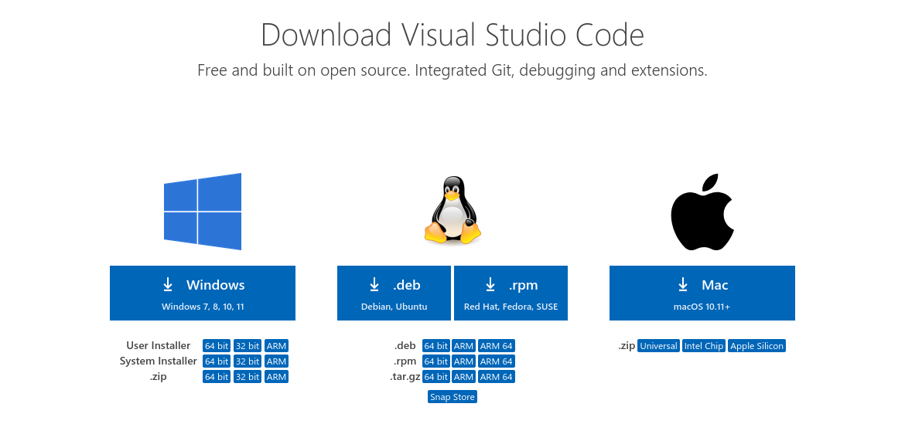
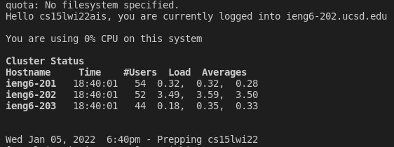
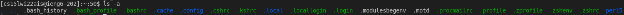
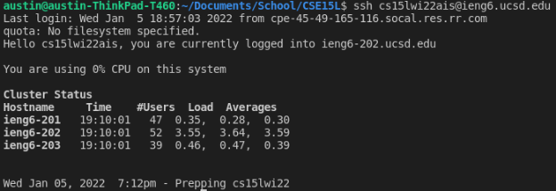

1\. Installing VSCode

+ go to [https://code.visualstudio.com/Download](https://code.visualstudio.com/Download)
+ download and install for whichever operating system you have



2\. Remotely Connecting

+ open VSCode, click Terminal at the top, and click New Terminal
+ type `ssh cs15lwi22zz@ieng6.ucsd.edu`, but replace zz with your account name
+ type your password (it won't display the characters) and press enter



3\. Trying Some Commands

+ try running `cd`, `ls`, `pwd`, `mkdir`, `cp`, and`cat` on the remote server, and use the error messages to figure out how to use them
+ to log out, press Ctrl+D or type `exit`



4\. Moving files with `scp`

+ create a new file `WhereAmI.java`
```
class WhereAmI {
	public static void main(String[] args) {
		System.out.println(System.getProperty("os.name"));
		System.out.println(System.getProperty("user.name"));
		System.out.println(System.getProperty("user.home"));
		System.out.println(System.getProperty("user.dir"));
	}
}
```
+ run `scp WhereAmI.java cs15lwi22zz@ieng6.ucsd.edu:~/`, but replace zz with your account name
+ type your password to finish copying the file
+ login using `ssh` and type `ls` to check that `WhereAmI.java` shows up


5\. Setting an SSH Key

+ on your computer, type `ssh-keygen`
+ copy the public key to the remote server `$ scp /path/to/id_rsa.pub cs15lwi22zz@ieng6.ucsd.edu:~/.ssh/authorized_keys`
+ the next time you use `ssh` or `scp`, you shouldn't have to type your password



6\. Optimizing Remote Running

+ you can type terminal commands at the end of the `ssh` command to run that command and immediately logout
+ `ssh cs15lwi22zz@ieng6.ucsd.edu "ls"` will run `ls` and logout
+ you can use `;` or `&& `between commands to type multiple commands on the same line
+ `&&` will cause the second command to run only if the first command succeeded
+ for example in `javac WhereAmI.java && java WhereAmI`, the `java` command would only run if there was actually a `WhereAmI.java` file to compile


