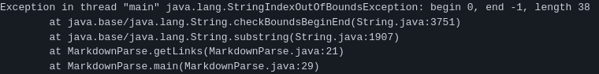

# Change 1

[test file 1](https://github.com/austin-li/markdown-parse/blob/main/file.md)

The symptom is that we were getting a StringIndexOutOfBoundsException when using substring. The bug is that closeParen is -1 because the test file had no link in it.

# Change 2

[test file 2](https://github.com/austin-li/markdown-parse/blob/main/file2.md)

The symptom is that we were getting a StringIndexOutOfBoundsException when using substring. The bug is similar to before where closeParen is -1, but Change 1 didn't fix this bug because in this case the test file had a partially completed link. 

# Change 3

[test file 3](https://github.com/austin-li/CSE15L-TheLunaMoths/blob/main/test-file8.md)

The symptom is that getLinks should have returned an empty List, but it returned a List with 1 element, which caused an AssertionError from JUnit. The bug is that MarkdownParse doesn't check if the String inside of the parentheses is a valid link. The test file has spaces inside of the parentheses, so our lab group decided it should not count as a link.