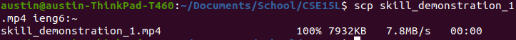

# SSH config file

+ I edited the file in a normal text editor
+ The file is named `config` and it is put in the `.ssh/` folder
+ The alias is called `ieng6`, which is short for connecting to the HostName `ieng6.ucsd.edu` and logging in with User `cs15lwi22ais`

# SSH

+ Instead of typing `ssh cs15lwi22ais@ieng6.ucsd.edu`, I only need to type `ssh ieng6`
+ Because I have the `id_rsa` file on my computer and the public key on `ieng6@ucsd.edu`, I don't need to type my password in

# SCP

+ The config file also works with scp to copy files more easily
+ Instead of typing `scp file cs15lwi22ais@ieng6.ucsd.edu:~`, I only need to type `scp file ieng6:~`
