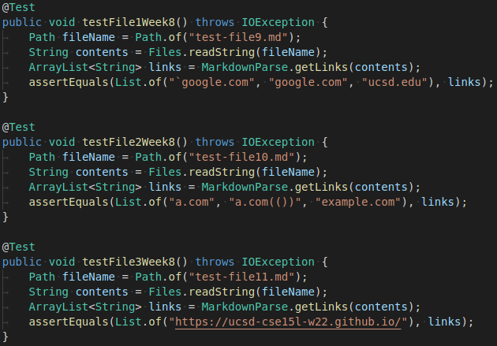
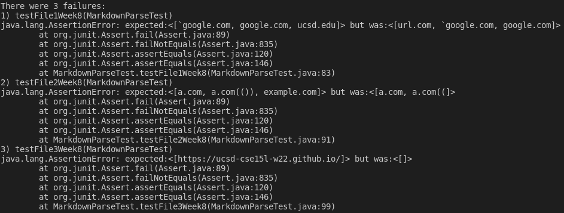
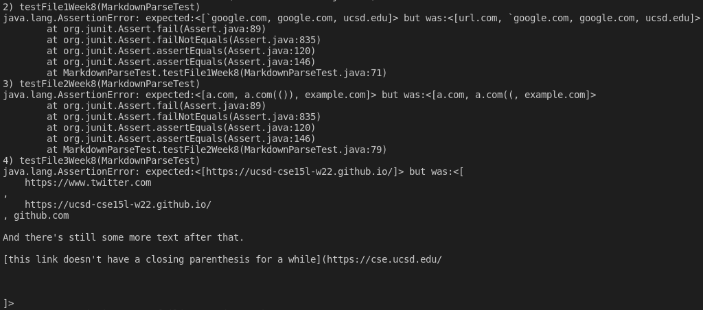

# Repositories

[My group](https://github.com/austin-li/CSE15L-TheLunaMoths)

[Reviewed group](https://github.com/yaz067/markdown-parse)

# Test Files

I used the [CommmonMark demo site](https://spec.commonmark.org/dingus/) to determine what the valid links are

# JUnit Test Results

## My lab

## Reviewed lab

# Code Changes

## Snippet 1

I think there is a small change to fix the first test case. All you have to do is keep track of where each backtick is and ignore square brackets in between backticks.

## Snippet 2

I think this would be a large change, since you need to figure out how to parse nested different brackets and also recognize escaped characters.

## Snippet 3

I think this would be a small change since you can just keep track of the number of newline characters between the left bracket, right bracket, left parenthesis, and right parenthesis and use that to figure out if it is a valid link
