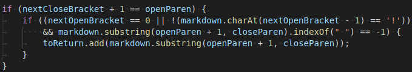
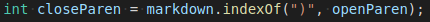

# FindingDiffering Results

+ I used `diff` on both of the `results.txt` to find the line numbers that were different

```
212c212
< []
---
> [url]
230c230
< []
---
> [baz]
866,867c866
< [foo
< bar]
---
> []
871,872c870
< [<foo
< bar>]
---
> []
880c878
< [\(foo\]
---
> [\(foo\)]
882c880
< [foo(and(bar]
---
> [foo(and(bar))]
884c882
< [foo(and(bar]
---
> []
886c884
< [foo\(and\(bar\]
---
> []
888c886
< [<foo(and(bar]
---
> []
918c916
< []
---
> [/uri]
920c918
< []
---
> [/uri]
922c920
< []
---
> [/uri]
936c934
< []
---
> [uri1]
1056c1054
< []
---
> [/url]
1058c1056
< []
---
> [/url]
1064c1062
< []
---
> [train.jpg]
1068c1066
< []
---
> [<url>]
1072c1070
< []
---
> [/url]
```

+ then I used `vim` and used the `gg` vim command to go to the specific line number to see what test it was different on

# Test 1

+ line 866 is `489.md`

```
[link](foo
bar)
```

+ our implementation said `foo\nbar` was a link, but actually there is no link because of the newline, so the markdown-parse answer is correct



+ the code should also check if the link contains a newline before adding it to toReturn

# Test 2

+ line 870 is `495.md`

```
[link](foo(and(bar)))
```

+ our implementation outputs `foo(and(bar` is wrong since it doesn't keep track of which open parentheses match up with which close parentheses



+ the fix is instead of using indexOf for close parentheses, use a loop like in markdown-parse to find the close parentheses that correctly matches up with openParen
